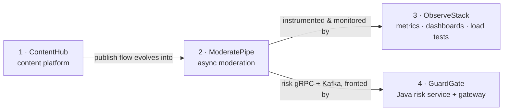
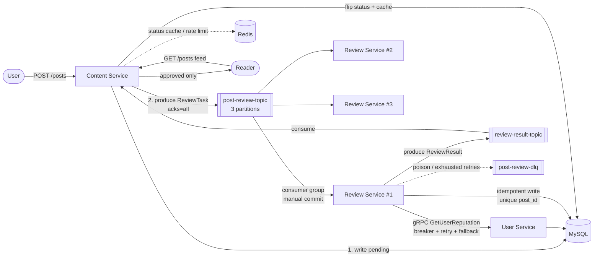

# ModeratePipe — Distributed Content Moderation Pipeline

A production-shaped, asynchronous content-moderation backend built as three
independent Go microservices communicating over **Kafka** (async events) and
**gRPC** (sync queries). It takes the synchronous "publish a post" flow from
[ContentHub](https://github.com/WindyRivers/content-hub-go) (Project 1) and
turns it into a real moderation pipeline: a post is not visible when created —
it is written `pending`, enqueued, run through a rule engine by an independently
scaled Review Service, and only becomes visible once it passes.

This is Project 2 of a connected backend portfolio. It exists to demonstrate the
distributed-systems concepts that content platforms (Zhihu's content governance,
Xiaohongshu's content-safety platform) are actually built on: message queues,
consumer groups, delivery semantics, idempotency, retries, dead-letter queues,
circuit breaking, graceful degradation, rate limiting, and chaos testing.

---

## Backend portfolio — how the four projects relate

This repo is **Project 2** — the hub — of a four-project backend suite built around one connected business line: a content platform plus the moderation system that governs it. Each project is its own repository and runs independently; together they tell a single, product-minded story.

| # | Project | Stack | Repo |
|---|---------|-------|------|
| 1 | ContentHub — content platform (publish / feed / social) | Go, Gin, GORM, MySQL, Redis, JWT | [content-hub-go](https://github.com/WindyRivers/content-hub-go) |
| **2** | **ModeratePipe — distributed moderation pipeline** | Go, gRPC, Kafka, Redis, MySQL | **← this repo** |
| 3 | ObserveStack — observability & reliability | Prometheus, Grafana, pprof, k6 | [observe-stack](https://github.com/WindyRivers/observe-stack) |
| 4 | GuardGate — Java risk service + API gateway | Java 17, Spring Boot 3, Spring Cloud Alibaba, gRPC | [guard-gate](https://github.com/WindyRivers/guard-gate) |



This project is the **center of gravity**: Project 1 feeds into it, and Projects 3 and 4 both build on it.

- **ContentHub → ModeratePipe:** *this* project takes Project 1's synchronous "publish a post" flow and turns it into an asynchronous, independently-scaled moderation pipeline (Kafka + gRPC).
- **ModeratePipe → ObserveStack:** Project 3 is the observability layer over *this* project's services (Prometheus / Grafana / k6 / pprof).
- **ModeratePipe → GuardGate:** Project 4 adds a **Java** risk-control service (it consumes *this* project's Kafka topics — a `rejected` result on `review-result-topic` becomes a risk signal — and answers the Review Service over gRPC) plus a unified API gateway in front of the system, making it polyglot (Go + Java).

Each project is independently deployable by design; the most integrated runnable demo is Project 2 + Project 4 together (GuardGate's `--profile full`).

---

## Table of contents

- [Architecture](#architecture)
- [The three services](#the-three-services)
- [Reliability model](#reliability-model-the-core-of-this-project)
- [Design decisions](#design-decisions)
- [Quick start](#quick-start)
- [API](#api)
- [Algorithm spotlight: Aho-Corasick](#algorithm-spotlight-aho-corasick)
- [Chaos engineering](#chaos-engineering)
- [Load test](#load-test)
- [Production notes / what I'd add next](#production-notes--what-id-add-next)
- [Project layout](#project-layout)
- [Testing](#testing)

---

## Architecture



Flow: **create → enqueue → moderate (async) → write back → become visible.** The
Content Service and Review Service never call each other synchronously; they are
decoupled by Kafka. The only synchronous hop is Review → User over gRPC, and
even that is made non-blocking with a circuit breaker and a fallback.

## The three services

Each is an independent Go process with its own `main`, independently deployable
and scalable (not a monolith with three entrypoints).

| Service | Transport | Responsibility |
|---|---|---|
| **content-service** | HTTP (stdlib) | Accept posts (write `pending` + produce Kafka task), serve moderation-status lookups and the approved-only feed, consume results and flip status. Rate-limited. |
| **review-service** | Kafka consumer + gRPC client | Consume tasks, run the rule engine (Aho-Corasick + length/image checks + reputation routing), write results idempotently, fan results back, dead-letter poison messages. **Scales horizontally as a consumer group.** |
| **user-service** | gRPC server | Own the users table; serve `GetUserReputation` / `GetUserProfile`; maintain a simple reputation score (more violations → lower score). |

## Reliability model (the core of this project)

### 1. Message reliability — no loss, no double-effect

- **Producer `acks=all`.** The Content Service waits for all in-sync replicas to
  persist a moderation task before returning success. A single broker failure
  right after a post is accepted cannot silently drop the task. `acks=1` is
  faster but loses data if the leader dies before replicating; `acks=0` loses
  data on any hiccup. For a moderation pipeline, a lost task means a post stuck
  invisible forever — not acceptable, so we pay the small replication latency.
- **Manual offset commits.** Consumers never auto-commit. The offset advances
  *only after* the moderation result is durably written. A crash before the
  commit simply redelivers the message → **at-least-once** delivery.
- **Idempotent consumer.** `moderation_results` has a unique index on `post_id`;
  the consumer does an INSERT-or-skip and a cheap pre-check. A redelivered
  message finds the result already present and skips it — verified live under a
  crash drill (10,894 distinct results, **zero duplicates**). This is the
  textbook pattern: **at-least-once delivery + idempotent consumer = effectively
  exactly-once**, without the cost of Kafka transactions.

### 2. Retries and dead-letter queue

- Persisting a result (DB write + result publish + reputation write-back) runs
  in a **bounded retry loop with exponential backoff** (3 attempts). A transient
  DB/broker blip self-heals instead of failing the message.
- A message that is **unparseable (poison)** or still failing after retries is
  forwarded to `post-review-dlq` with a failure reason and an `ALERT` log line,
  then its offset is committed so it can't wedge the partition.

### 3. Service fault tolerance — the User Service can go down

The Review → User gRPC path is wrapped in three layers (inside-out): per-call
**timeout** → **retry with backoff** → **circuit breaker** (`sony/gobreaker`).
When all of that still yields nothing, the reputation lookup returns a **default
with `degraded=true`** and the rule engine **skips the reputation gate**
(fail-open) rather than stalling or dead-lettering. A dependency outage degrades
the feature, not the pipeline. Verified live: with the User Service stopped,
posts kept flowing, decisions were written `degraded=true`, and the breaker
recovered on restart.

### 4. Rate limiting and backpressure

- The Content Service's create endpoint is rate-limited by a **Redis token
  bucket** (shared across replicas), shielding the pipeline from a traffic burst
  outrunning it.
- **Kafka provides peak-shaving:** the producer never blocks on the slower,
  gRPC-bound consumers — the queue absorbs the spike and the consumer group
  drains it at its own pace. Measured: a ~3,100-message burst absorbed and
  drained to zero (see [Load test](#load-test)).

## Design decisions

| Decision point | Choice | Rationale |
|---|---|---|
| Delivery semantics | At-least-once + idempotent consumer | Effectively exactly-once without Kafka transactions' complexity/cost. Unique `post_id` index is the idempotency key. |
| Producer acks | `acks=all` | A moderation task must not be lost; correctness > the small replication-latency premium. |
| Offset commit | **Manual**, after processing | Auto-commit on a timer can advance past an unprocessed message → silent loss. Commit-after-write gives at-least-once. |
| Message payload | **Content snapshot**, not just `post_id` | Pins exactly what is being judged (no re-query race if the post is edited/replicated after the event) and decouples the Review Service from the Content DB. Cost: bigger messages — fine for text posts; use a "claim check" (object-store URL) for large blobs. |
| Kafka partitions | 3 (topic), = max consumers | Partition count is the ceiling on consumer-group parallelism; one consumer per partition. 3 partitions → up to 3 Review Service instances share load; a 4th sits idle. Size partitions for peak parallelism up front (repartitioning reshuffles keys). |
| Inter-service sync call | gRPC | Internal, high-frequency, low-latency, schema-checked; generated stubs beat hand-rolled JSON. |
| Circuit breaker | `sony/gobreaker`, trip at >60% failures over ≥5 reqs | Battle-tested lib over a hand-rolled breaker; threshold avoids tripping on a single blip but reacts fast to a real outage. |
| Dependency failure | Degrade (fail-open), **not** DLQ | An outage of a non-critical dependency shouldn't dead-letter the whole stream. DLQ is reserved for poison messages. Degraded decisions are flagged for audit. |
| Rate limiter store | Redis (Lua token bucket) | Atomic check-and-decrement in Redis; limit shared across Content Service replicas (an in-process limiter wouldn't be). |
| Web layer | stdlib `net/http` | The pipeline is the interesting part; Project 1 already shows Gin. Fewer deps here. |
| Schema ownership | GORM `AutoMigrate`, shared DB | Reuses Project 1's schema; models are the single source of truth. Trade-off noted below under production notes. |
| Service discovery | Compose DNS + fixed ports | Sufficient at this scale; production path (Consul/etcd) documented below. |

## Quick start

Prereqs: Docker + Docker Compose. One command builds all three services and
brings up Kafka (single-node KRaft, **no Zookeeper**), MySQL and Redis:

```bash
cd moderation
docker compose up --build -d --scale review-service=3   # or: make scale
```

The stack seeds three demo users (`alice`, `bob`, and low-reputation `troll`)
and a small sensitive-word list, so the pipeline works immediately.

```bash
# 1) a clean post -> approved
curl -s -XPOST localhost:8080/posts \
  -d '{"user_id":1,"title":"Hello","content":"a perfectly normal first post"}'

# 2) a sensitive-word post -> rejected (Aho-Corasick matches "casino")
curl -s -XPOST localhost:8080/posts \
  -d '{"user_id":1,"title":"deal","content":"come to my casino and win"}'

# 3) a post from the low-reputation user -> manual_review (via gRPC reputation)
curl -s -XPOST localhost:8080/posts \
  -d '{"user_id":3,"title":"hi","content":"just a normal post"}'

sleep 2
curl -s localhost:8080/posts/1/status   # {"post_id":1,"review_status":"approved"}
curl -s localhost:8080/posts/2/status   # {"post_id":2,"review_status":"rejected"}
curl -s localhost:8080/posts/3/status   # {"post_id":3,"review_status":"manual_review"}
curl -s "localhost:8080/posts?limit=10" # feed shows only the approved post
```

Ports are offset from Project 1 so both stacks can run side by side: MySQL
`3307`, Redis `6380`, Kafka host listener `29092`, Content Service `8080`.

## API

| Method | Path | Description |
|---|---|---|
| `POST` | `/posts` | Create a post. Returns `202 Accepted` with `post_id` and `review_status: pending`. Rate-limited (`429` when exceeded). |
| `GET` | `/posts/{id}/status` | Current moderation status: `pending` / `approved` / `rejected` / `manual_review` (cache-first). |
| `GET` | `/posts?limit=N` | The reader feed — **approved posts only**. |
| `GET` | `/healthz`, `/readyz` | Liveness / readiness. |

User Service gRPC: `GetUserReputation`, `GetUserProfile` (see
[`proto/user.proto`](proto/user.proto)).

## Algorithm spotlight: Aho-Corasick

Sensitive-word filtering uses an **Aho-Corasick automaton**
([`pkg/ahocorasick`](pkg/ahocorasick/ahocorasick.go)) rather than brute-force
`strings.Contains` per word. Brute force is O(n·m·k) — for text length n and k
patterns of average length m, every pattern rescans the whole text. Aho-Corasick
builds a trie with **failure links** (KMP's failure function generalised to many
patterns) once, then scans the text **exactly once in O(n + z)** (z = matches),
**independent of block-list size**. For a moderation hot path whose word list
grows into the thousands while every post must be scanned, that is the difference
between linear and quadratic work. The implementation is rune-based so it handles
CJK block lists, and case-folds ASCII. Unit tests cover overlapping patterns,
failure-link suffix matches, and CJK.

## Chaos engineering

Full write-up with live observations in **[docs/CHAOS.md](docs/CHAOS.md)**.
Summary:

- **Kill a Review instance under load** → Kafka consumer group rebalances, the
  dead partition is reassigned to a survivor, backlog drains to zero, and the
  final DB shows **10,894 distinct results with zero duplicates** — no loss, no
  double-processing.
- **Stop the User Service** → breaker opens, reputation lookups fall back
  (`degraded=true`), posts keep flowing instead of stalling; recovers on restart.
- **Backpressure** → limiter sheds excess (`429`) while Kafka absorbs the burst.

Run them: `make chaos-kill` / `make chaos-degrade`.

## Load test

Full report in **[docs/LOADTEST.md](docs/LOADTEST.md)**. Headline (single
laptop, 3 review replicas, generator `cmd/loadgen`):

| Metric | Value |
|---|---|
| Accepted throughput | ~228 req/s (rate-limited by design) |
| Latency p50 / p99 | 76 ms / 190 ms |
| Kafka burst absorbed | ~3,100 msgs, drained to 0 lag in ~20s |
| Message loss | none |

> Single-machine numbers to show relative behaviour and that the reliability
> mechanisms hold — not a tuned production SLO.

## Production notes / what I'd add next

Honest about the shortcuts taken to keep the project focused:

- **Service discovery.** Services find each other via Docker Compose DNS +
  fixed ports. In production I'd register them in **Consul or etcd** (or use
  Kubernetes Services / a service mesh) so instances are discovered dynamically,
  health-checked, and load-balanced without hardcoded addresses — which also
  makes gRPC client-side load balancing across User Service replicas real.
- **Dual-write / transactional outbox.** Create does a DB write then a Kafka
  publish — two systems, so a crash between them could leave a post `pending`
  with no task enqueued. The write order (DB first) makes the failure mode a
  stuck-pending post, never a task for a non-existent post. The production fix is
  the **transactional outbox** pattern (write the event to an outbox table in the
  same DB transaction, relay it to Kafka), which I'd add next.
- **Reputation write-back** currently updates the shared `users` table directly
  from the Review Service (both services share Project 1's DB). Stricter service
  ownership would make this a dedicated RPC or a Kafka event the User Service
  consumes; the shared-DB shortcut is documented in code.
- **Migrations.** `AutoMigrate` is fine for a single-owner schema; a multi-writer
  production system wants versioned, reversible migrations (golang-migrate).
- **Observability.** Structured logs capture end-to-end latency today; Project 4
  of this suite adds Prometheus/Grafana/pprof on top of these services.

## Project layout

```
moderation/
├── cmd/
│   ├── content-service/     # HTTP front door
│   ├── review-service/      # Kafka consumer + rule engine
│   ├── user-service/        # gRPC server
│   └── loadgen/             # load generator
├── internal/
│   ├── config/              # shared env-based config
│   ├── event/               # Kafka message contracts (ReviewTask, ReviewResult)
│   ├── model/               # GORM models (User, Post, ModerationResult, SensitiveWord)
│   └── store/               # MySQL (boot-retry) + Redis wiring
├── pkg/
│   ├── ahocorasick/         # multi-pattern matcher (+ tests)
│   ├── kafkax/              # producer (acks=all) / consumer (manual commit) / admin
│   ├── ratelimit/           # Redis token-bucket limiter
│   └── logger/              # zap wrapper
├── services/
│   ├── content/  review/  user/   # per-service business logic
├── proto/                   # user.proto + generated stubs
├── scripts/                 # loadtest + chaos drills
├── docs/                    # LOADTEST.md, CHAOS.md
├── docker-compose.yml       # Kafka(KRaft)+MySQL+Redis+3 services
└── Dockerfile               # one recipe, SERVICE build-arg
```

## Testing

```bash
make test    # unit tests: Aho-Corasick automaton + rule engine
make vet
```

The Aho-Corasick automaton and the rule engine are unit-tested (overlapping
patterns, CJK, case-folding, and every rule branch including degraded fail-open).
The reliability behaviours (rebalance, idempotency, degradation, backpressure)
are validated end-to-end by the chaos and load scripts against the live stack,
with results recorded in `docs/`.

---

Built with Go 1.26, Kafka 3.8 (KRaft), gRPC, MySQL 8, Redis 7, Docker Compose.
